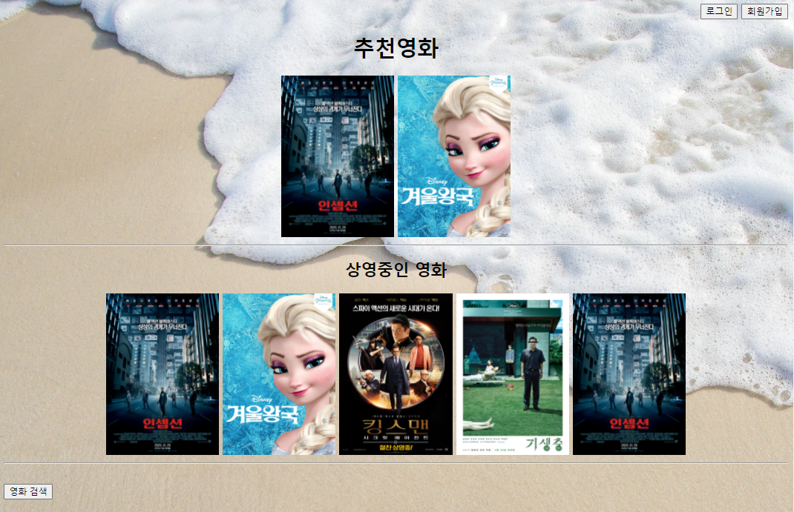

# 💡 JSP 영화예매 프로젝트
- JSP는 Eclipse를 사용해 진행하였습니다.
- DataBase는 Oracle을 사용해 진행하였습니다.
- 부분 Bootstrap을 사용해 진행하였습니다.
- 기존 Java+DB 영화예매 프로젝트를 JSP프로젝트로 업그레이드 구현하였습니다.
 

## <제작기간 및 개발인원>
- 기간 : 2021.11 ~ 2021.11 (약 1주)
- 개발 인원 : 3명
 

## <주요기능>

- 메인화면

