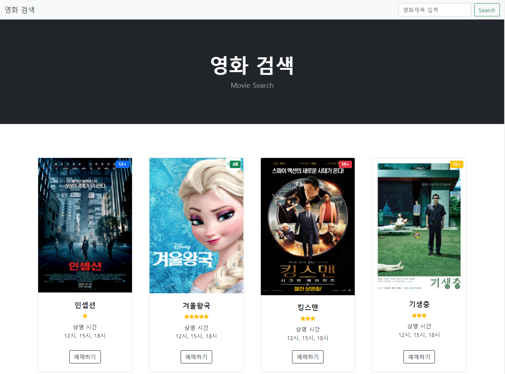
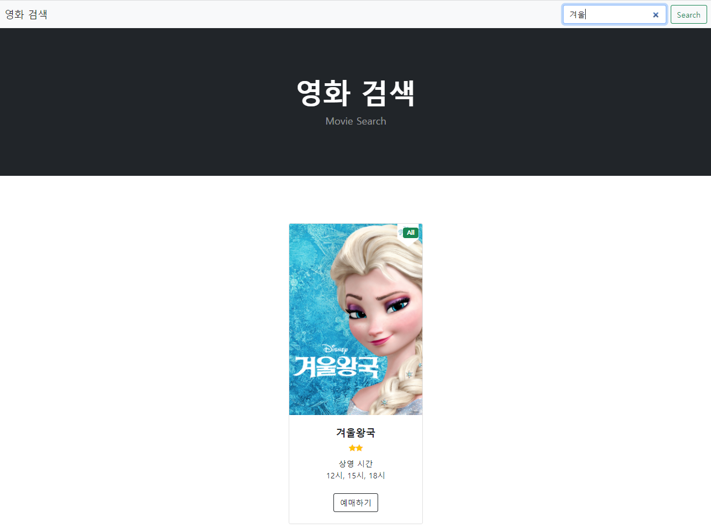
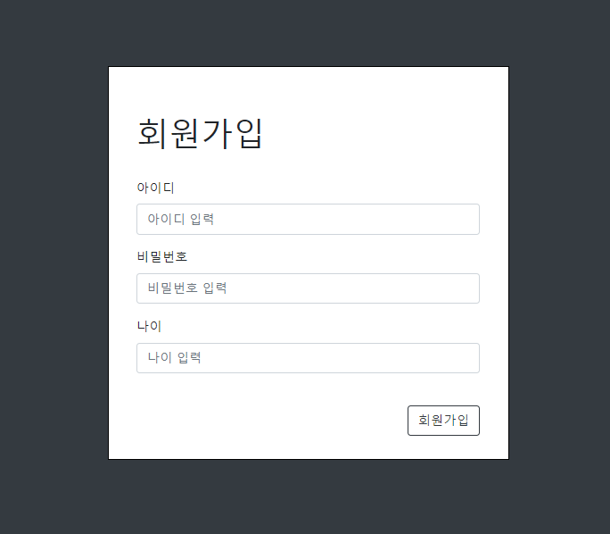
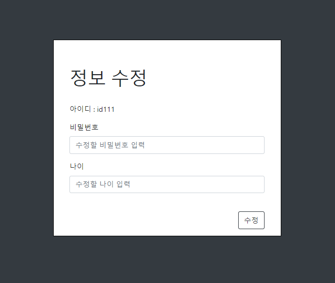
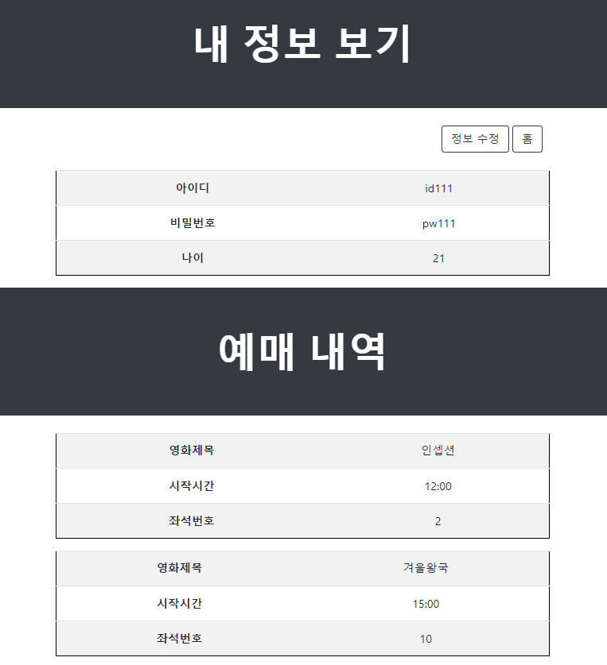

# 💡 JSP 영화예매 프로젝트
- JSP는 Eclipse를 사용해 진행하였습니다.
- DataBase는 Oracle을 사용해 진행하였습니다.
- 부분 Bootstrap을 사용해 진행하였습니다.
- 기존 Java+DB 영화예매 프로젝트를 JSP프로젝트로 업그레이드 구현하였습니다.
<br>

## <제작기간 및 개발인원>
- 기간 : 2021.11 ~ 2021.11 (약 1주)
- 개발 인원 : 3명
<br>

## <주요기능>

#### * 메인화면


- 상영중인 영화와 추천 영화가 표시됩니다.
- 로그인 하지않으면 예매할 수 없으며, 검색만 가능합니다.

#### * 영화검색





- 검색된 단어와 DB의 Title을 비교해 일치한 값을 읽어와 화면에 보여줍니다.

```
/// search.jsp
dtos2= service2.getAllMovieSearch();
	
	for (int i = 0; i < dtos2.size(); i++) {%>
	<div class="col mb-5">
    <div class="card h-100">
        <!-- 관람 나이 표기-->
        
        <%if(dtos2.get(i).getAge_Limit()==19) {%>
        	<div class="badge bg-danger text-white position-absolute" style="top: 0.5rem; right: 0.5rem">19+</div>
        <% }else if(dtos2.get(i).getAge_Limit()==15){ %>
        			<div class="badge bg-warning text-white position-absolute" style="top: 0.5rem; right: 0.5rem">15+</div>
        <% }else if(dtos2.get(i).getAge_Limit()==12){ %>
        			<div class="badge bg-primary text-white position-absolute" style="top: 0.5rem; right: 0.5rem">12+</div>
        <% }else if(dtos2.get(i).getAge_Limit()==0){ %>
        			<div class="badge bg-success text-white position-absolute" style="top: 0.5rem; right: 0.5rem">All</div>
        <%}%>
        
        <!-- image-->
        " alt="..." />
        <!-- Product details-->
        <div class="card-body p-4">
            <div class="text-center">
                <!-- Product name-->
                <h5 class="fw-bolder"><%=dtos2.get(i).getTitle()%></h5>
                <!-- Product reviews-->
                <div class="d-flex justify-content-center small text-warning mb-2">
              <%int ramdomNum=(int)((Math.random()*10000)%5);
                for (int j=0; j<=ramdomNum;j++){ %>
                    <div class="bi-star-fill"></div>
				<%} %>
                
                </div>                
            </div>
        </div>
```

#### * 회원가입 및 정보 수정

- ID는 PK지정으로 변경이 불가능하며, 비밀번호와 나이만 변경이 가능합니다.





#### * 회원정보 및 예매 내역 조회

- DB에 저장된 회원정보와 예매 내역을 조회합니다.
- 정보수정을 누르면 수정창으로 이동합니다.
- 예매내역이 없다면 화면에 정보만 출력됩니다.




